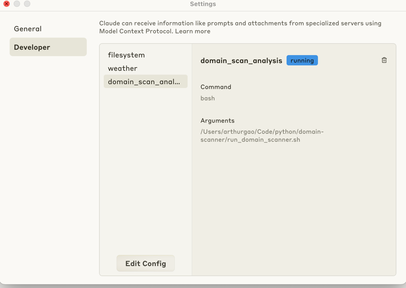
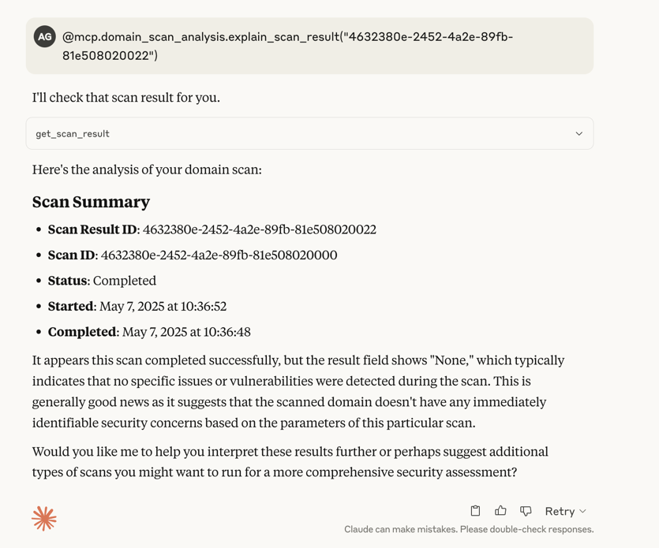

## 🔧 Structure

    ├── alembic/                   # Database migration scripts
    ├── alembic.ini                # Alembic config
    ├── app/
    │   ├── core/                  # Security, dependencies, configuration
    │   ├── db/                    # Session and base metadata
    │   ├── jobs/                  # Task execution logic (e.g. ScanTask)
    │   ├── models/                # SQLAlchemy models (User, Org, Scan, Schedule)
    │   ├── repositories/          # Repositories for each entity
    │   ├── routers/               # FastAPI routes (auth, users, scan, etc.)
    │   ├── schemas/               # Pydantic schemas (request/response)
    │   ├── services/              # Business logic layer
    │   ├── uow/                   # Unit of Work implementation
    │   └── main.py                # FastAPI application entrypoint
    ├── scripts/                   # CLI scripts (create admin, create tables)
    ├── requirements.txt           # Python dependencies
    └── README.md (to be generated)                                             

This project is a SaaS-style FastAPI application that allows users to register domains and schedule vulnerability scans. It supports multi-tenant architecture, JWT authentication, and scan scheduling via APScheduler.

## 🔧 Features

- 🏢 Multi-tenant organization and user management
- 🔐 JWT-based auth with role-based access (admin, user)
- 🖥 Domain scan scheduling (immediate or recurring: cron, interval, date)
- 📬 Email or dashboard-based result notifications
- 📊 Dashboard-ready endpoints and scan trend storage
- 🧩 Clean architecture: separation of models, services, UoW, and routers

## 📁 Project Structure

```text
{project_structure}
```

## 🚀 Getting Started

- **Install dependencies**

```bash
pip install -r requirements.txt
```

- **Setup environment**

```bash
cp .env.example .env
# Edit environment variables (DB, JWT secret, etc.)
```
- Launch PostgreSQL

```bash
docker-compose up -d
```

- **Run Alembic migrations**

```bash
alembic upgrade head
```

- **Run development server**

```bash
 uvicorn app.main:app --reload --host 0.0.0.0 --port 8000
```

- **(Optional) Create default admin user**

```bash
PYTHONPATH=. python scripts/create_admin_user.py
```

## How to use

1. Login with super admin
```curl
curl --location 'http://0.0.0.0:8000/api/auth/login' \
--header 'Content-Type: application/json' \
--data-raw '{
    "email" : "admin@example.com",
    "password": "admin123"
}'
```
Get JWT token from the response.

2. Create a new organization
```curl
curl --location 'http://0.0.0.0:8000/api/orgs' \
--header 'Authorization: Bearer {{token}}' \
--header 'Content-Type: application/json' \
--data '{
    "name" : "TestOrg1"
}'
```
replace {token} with the JWT token from step 1.

3. Create a new user
```curl
curl --location 'http://0.0.0.0:8000/api/users' \
--header 'Authorization: Bearer {{token}}' \
--header 'Content-Type: application/json' \
--data-raw '{
    "email" : "test@test.com",
    "password" : "12345",
    "organization_id" : "c8497b18-ac88-49a9-ab84-c6f3ce2c87cf"
}'
```
>  **NOTE** : URL can be changed to `http://0.0.0.0:8000/api/{org_id}/users` to create user in specific org. And here will be a validation for if the admin belongs to this org_id.

4. Login with user and get JWT token

5. Create a user scan

- Monthly scan
```curl
curl --location 'http://0.0.0.0:8000/api/scan' \
--header 'Authorization: Bearer {{token}}' \
--header 'Content-Type: application/json' \
--data '{
  "name": "Monthly Vulnerability Scan",
  "type": "scheduled",
  "target": "example.com",
  "schedule": {
    "schedule_type": "cron",
    "cron_minute": "0",
    "cron_hour": "12",
    "cron_day": "1",
    "cron_month": "*",
    "cron_day_of_week": "*",
    "enabled": true
  }
}'
```

- Minute scan
```curl
curl --location 'http://0.0.0.0:8000/api/scan' \
--header 'Authorization: Bearer {{token}}' \
--data '{
  "name": "Every Minute Scan",
  "type": "scheduled",
  "target": "example.com",
  "schedule": {
    "schedule_type": "cron",
    "cron_minute": "*",
    "cron_hour": "*",
    "cron_day": "*",
    "cron_month": "*",
    "cron_day_of_week": "*",
    "enabled": true
  }
}'
```
>  **NOTE** : URL is not properly defined yet. It will be changed to `http://0.0.0.0:8000/api/{org_id}/users/scan.  Here also need validation for if the admin belongs to this org_id.

## AI analysis
Add relational DB MCP to Claude for desktop(mcp_scan_server.py). Which make Claude LLM(local) can access to our DB and do analysis.



## 📬 Health Check

```bash
GET /health
Response: {{"status": "ok"}}
```

---

## 📚 Tech Stack

- **FastAPI** – Web framework
- **PostgreSQL** – Relational DB
- **SQLAlchemy** – ORM
- **Alembic** – Migrations
- **APScheduler** – Job scheduling
- **Pydantic v2** – Data validation

---

## ✅ TODO (optionally)

- [ ] AI-based result summarization
- [ ] Frontend dashboard (React or Next.js)
- [ ] CI/CD deployment support
"""
